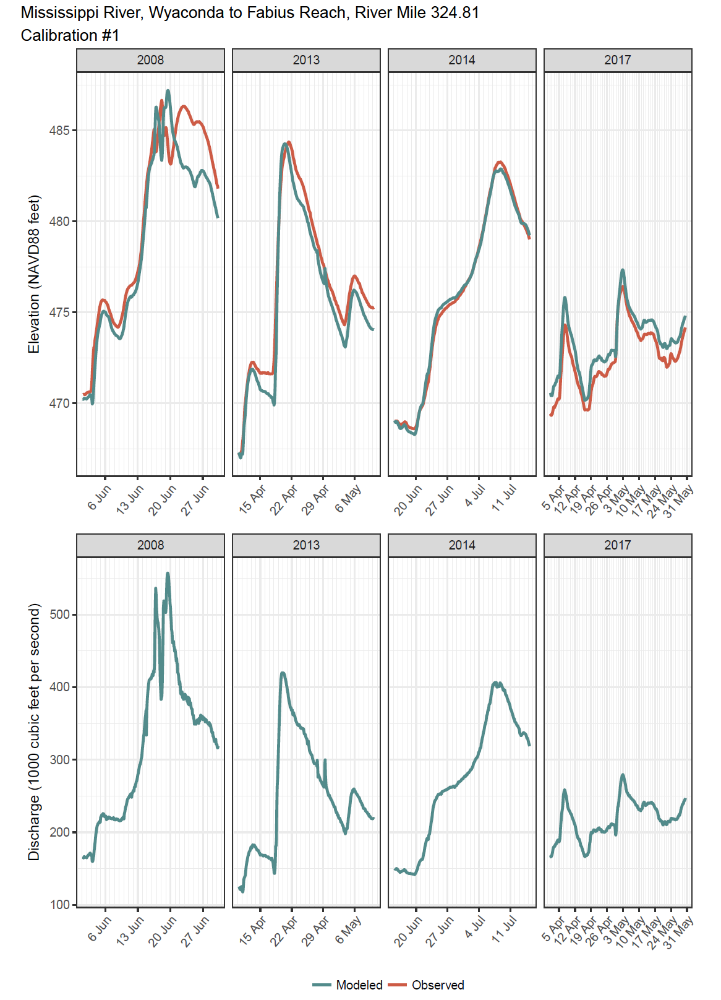
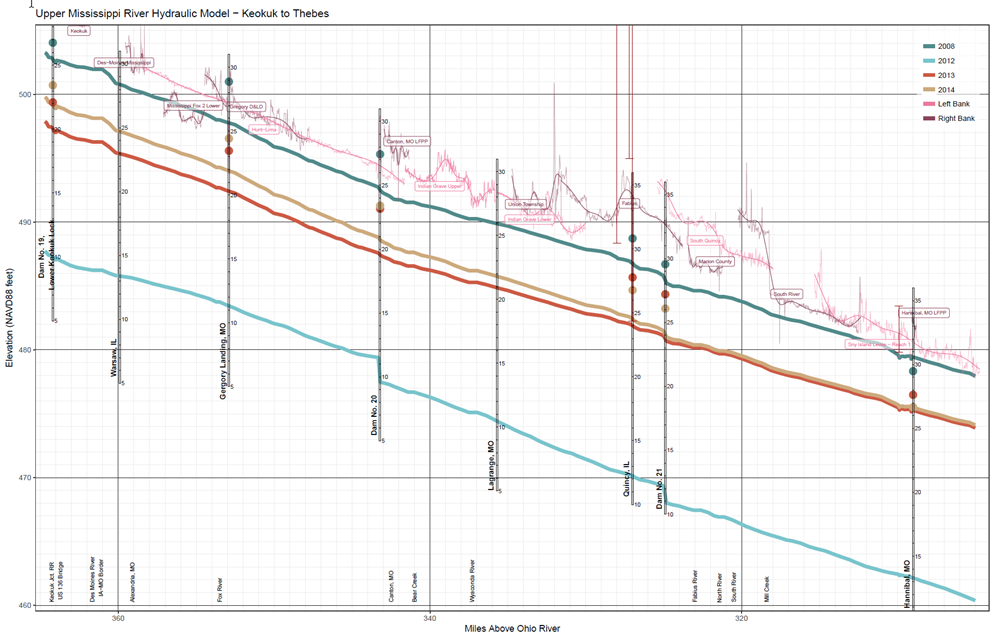

<!-- README.md is generated from README.Rmd. Please edit that file -->

# razviz {#razviz}
An R package to produce visualizations for evaluating the performance of  [HEC-RAS](https://www.hec.usace.army.mil/software/hec-ras) models. 

## Package Status
[](https://www.tidyverse.org/lifecycle)
[](https://www.repostatus.org/#active)
[](commits/master)
[)`-yellowgreen.svg)](/commits/master)
[](http://choosealicense.com/licenses/cc0-1.0/)

## Description
This package contains a set of standard graphing and summary table functions to help streamline the review and evaluation of HEC-RAS model results during calibration. The package currently contains functions for producing reports containing the following visualizations:

* **Hydrographs** - Compare modeled versus observed values for both water surface elevation and discharge by cross section and model scenario. 

* **Longitudinal Profile Graph** - Compare water surface elevation by river mile for multiple model scenarios. Graphs can also contain additional annotations (i.e., river gage locations, levee elevations, bridge elevations, river features, and high water marks) helpful for evaluating model results. 

* **Goodness of Fit Statistics Tables** - A table of goodness of fit statistics (i.e., R^2, RMSE, MAE) between modeled versus observed values by cross section and model scenario. 

## Funding
Funding for the development and maintenance of `razviz` was provided by the US Army 
Corps of Engineers (USACE). <!--add program names here -->

## Latest Updates
Check out the [NEWS](NEWS.md) for details on the latest updates. 

## Authors
* Michael Dougherty, Geographer, U.S. Army Corps of Engineers, Rock Island District
* Leigh Allison, Hydraulic Engineer, U.S. Army Corps of Engineers, St. Paul District
* David Tsai, Hydraulic Engineer, U.S. Army Corps of Engineers, Rock Island District
* Daniel Smith, Hydraulic Engineer, U.S. Army Corps of Engineers, Rock Island District

## Install
To install the `razviz` package, install from GitHub using the `devtools` package:

```r
library(devtools)
devtools::install_github(repo = "mpdougherty/razviz", build_vignettes = TRUE)
```

## Vignettes
Learn how to use the `razviz` package to visualize your HEC-RAS model results:

* [Create a Longitudinal Profile Graph](https://mpdougherty.github.io/razviz/doc/longitudinal_profile.html)
* [Compare Modeled versus Observed Hydrographs](https://mpdougherty.github.io/razviz/doc/hydrographs.html)

## Bug Reports
If you find any bugs while using `razviz`, please open an issue in this repository. 
